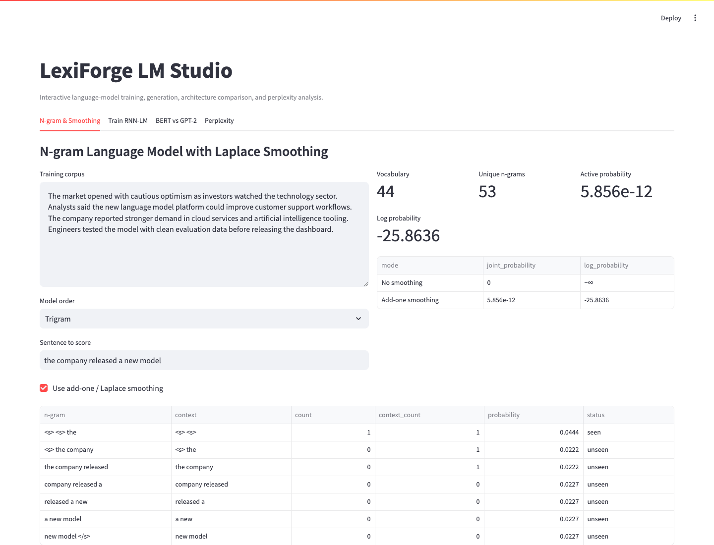
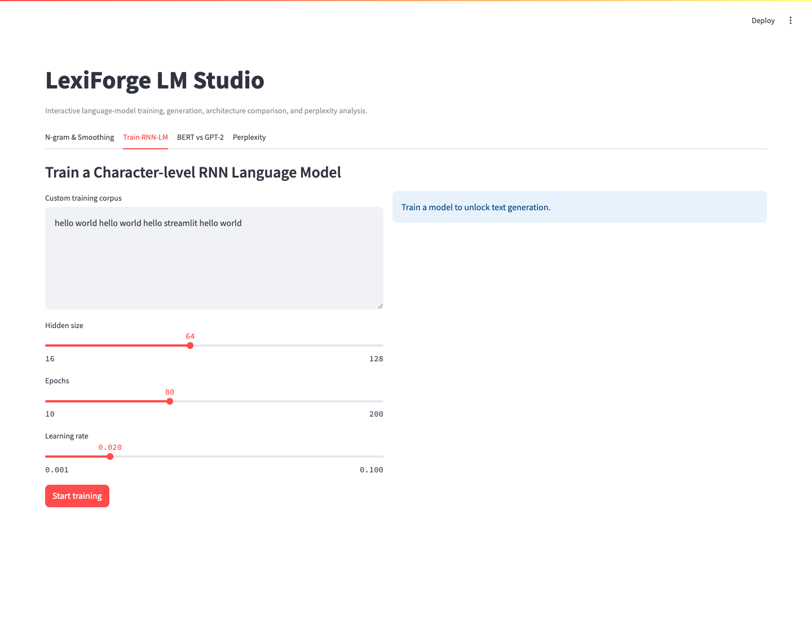
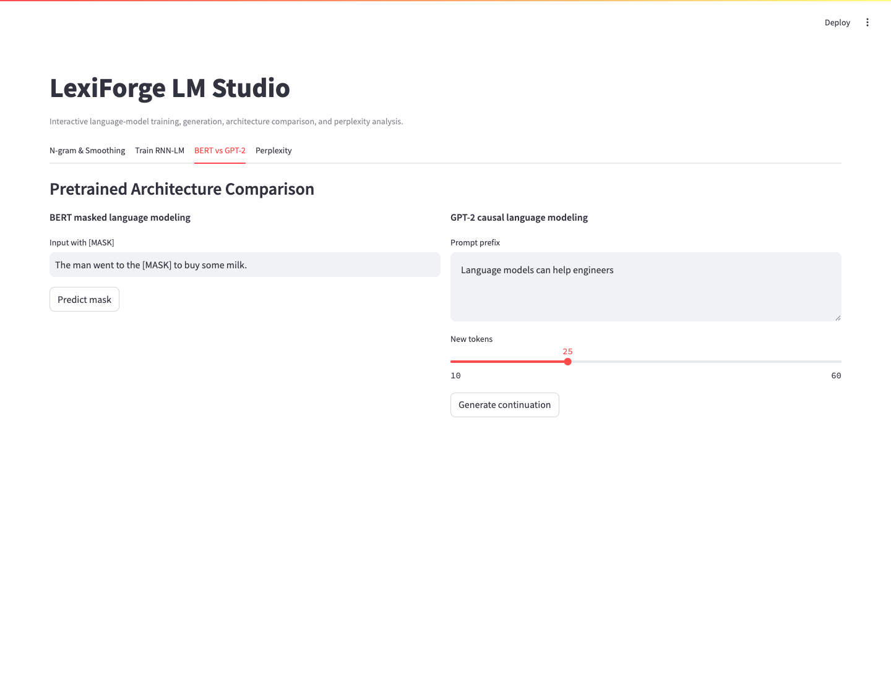
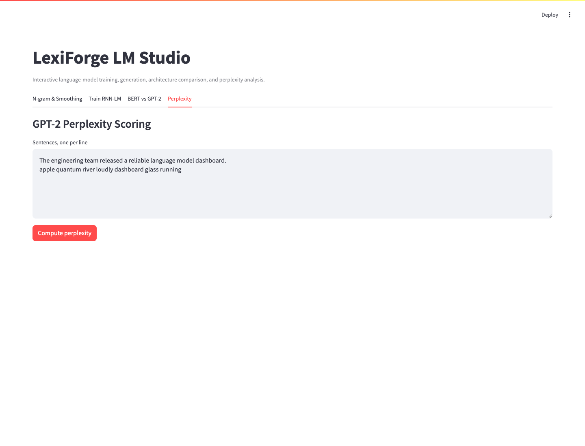

# LexiForge LM Studio

## Page Overview

LexiForge LM Studio is an interactive Streamlit workspace for comparing classic statistical language models, a trainable character-level RNN, and modern pretrained Transformer workflows in one place.

Screenshots are generated from the running application and stored in `assets/screenshots/`.









## What It Does

- Builds Bigram or Trigram language models from a custom English corpus.
- Scores sentence probability with and without Add-one / Laplace smoothing.
- Trains a character-level LSTM language model directly in the browser workflow.
- Generates text from a user-provided seed after training.
- Compares BERT masked-token prediction with GPT-2 left-to-right continuation.
- Computes GPT-2 cross-entropy and perplexity for multiple sentences.

## Tech Stack

- Streamlit for the interactive web interface
- NLTK-style n-gram processing utilities and token statistics
- PyTorch for the custom RNN language model
- Hugging Face Transformers for BERT and GPT-2 inference
- Pandas for probability tables and metric displays

## Quick Start

```bash
python3 -m venv .venv
source .venv/bin/activate
pip install -r requirements.txt
streamlit run app.py
```

Open the local Streamlit URL shown in your terminal, usually `http://localhost:8501`.

## Product Modules

### N-gram & Smoothing

The first workspace builds a Bigram or Trigram model from the supplied corpus, calculates the joint probability of a test sentence, and exposes the difference between sparse maximum-likelihood estimates and Add-one smoothing.

### Train RNN-LM

The second workspace trains a compact character-level LSTM on user-entered text. It provides controls for hidden size, epoch count, and learning rate, then renders the training loss curve and generated continuation.

### BERT vs GPT-2

The third workspace compares two pretrained inference patterns:

- BERT fills a `[MASK]` token using bidirectional context.
- GPT-2 continues a prefix using causal left-to-right generation.

### Perplexity

The final workspace evaluates text with GPT-2 and reports cross-entropy plus perplexity, making it easy to compare fluent sentences with noisy or unlikely text.

## Notes

The BERT and GPT-2 modules download pretrained weights the first time they are used. Subsequent runs reuse the local Hugging Face cache.
